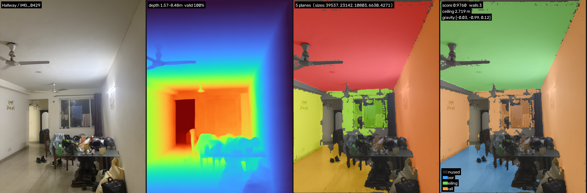
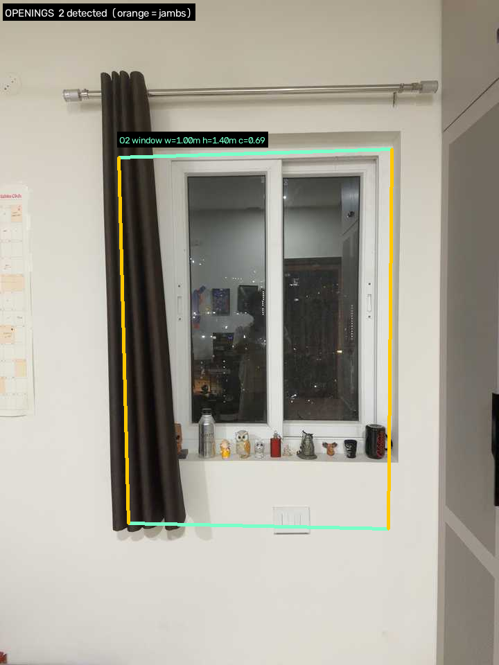
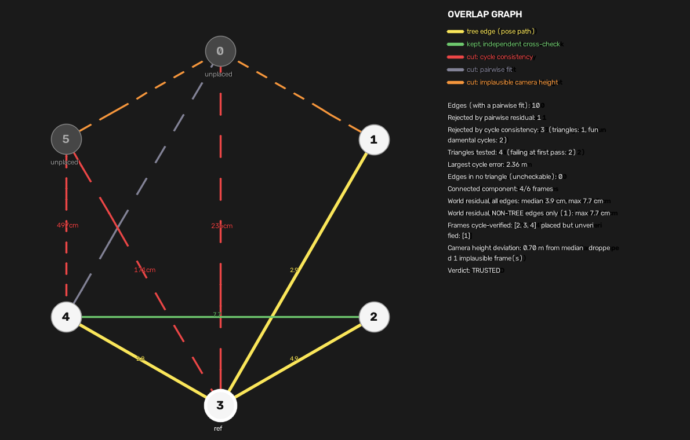
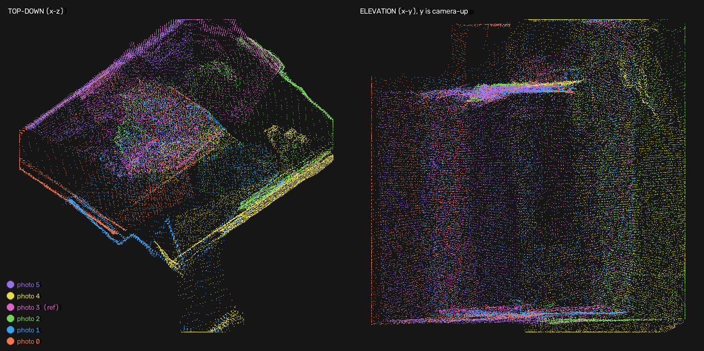
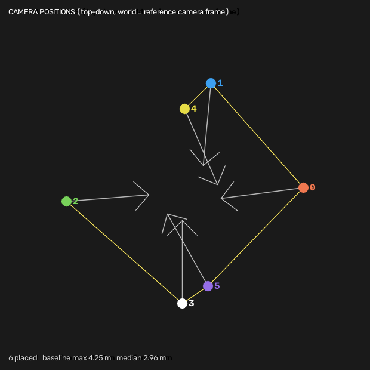
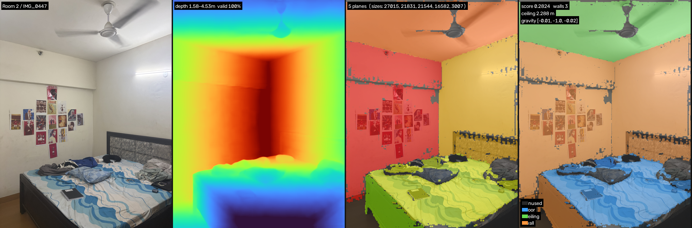
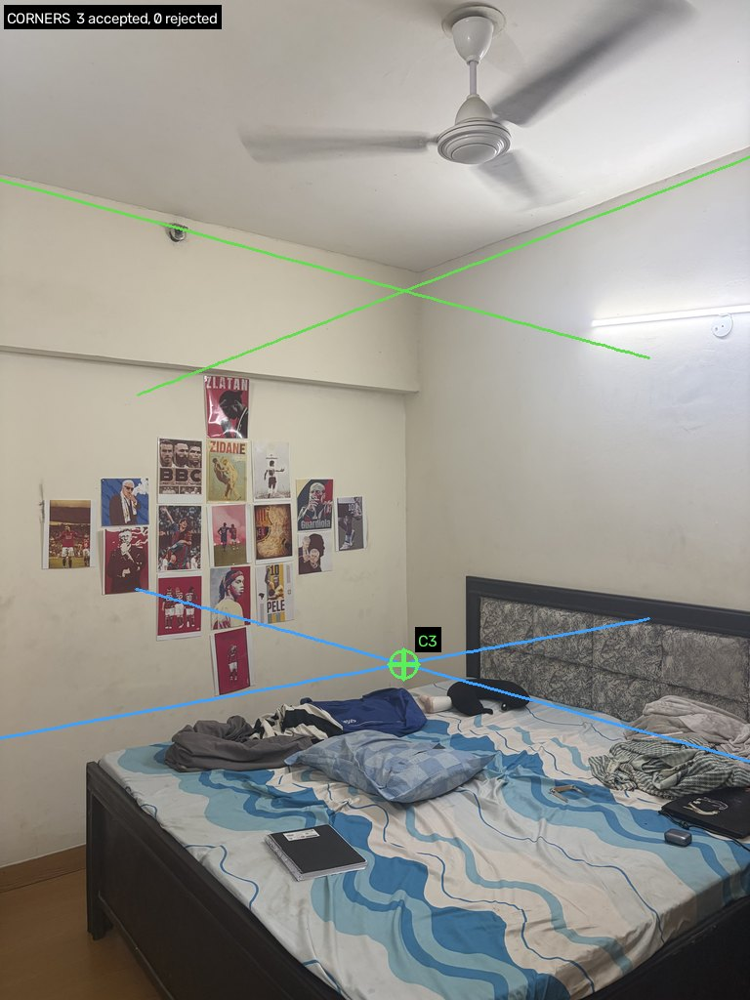
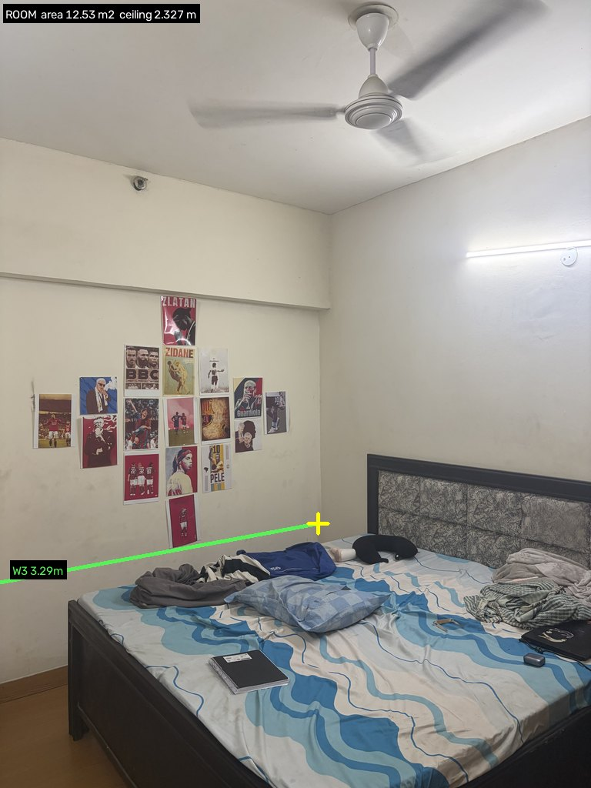
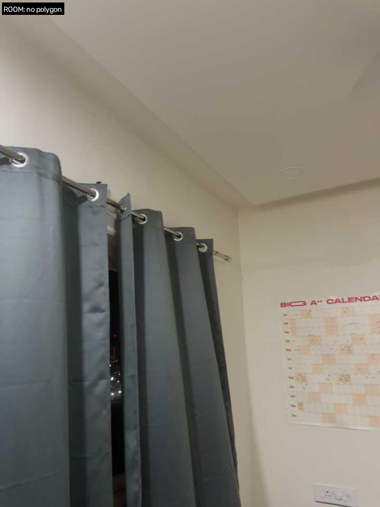

# Technical Report — Cozmo AI Case Study

Handheld capture (photo / video / LiDAR) → dimensioned property plan. One organising rule
drives every design choice below:

> **Models supply structure. Geometry computes measurements.**

A network is only ever asked for depth. Every dimension reported is the distance between
planes fitted to tens of thousands of points — auditable line by line, not a black-box guess.

---

## 1. Architecture

```
              photo folders        video clip           .r3d / stray zip
                    |                   |                       |
   capture/    load + EXIF K     sample + odometry        unzip + poses
                    |                   |                       |
              metric depth        metric depth              LiDAR depth
                    \                   |                       /
                     `----------- lift to points + normals ----'
                                        |
                              [poses?] ---- yes ----> fuse to one world cloud
                                        |
   geometry/                   RANSAC planes -> merge coplanar
                                        |
                                gravity (prior-constrained)
                                        |
                    joint floor/ceiling selection (or abstain)
                                        |
                        conservative Manhattan regularisation
                                        |
            +----------------------------+----------------------------+
            |                            |                             |
      ceiling height             wall-pair spans                openings as holes
                                        |
   video/lidar only:      doorway-crossing segmentation -> per-room walls
                              -> adjacency + drift correction -> blueprint
                                        |
   output/                     intervals -> JSON + PNG/SVG plan
```

Everything below `capture/` is **tier-agnostic** — it branches on whether a frame carries a
pose, never on the tier name, so a video whose odometry fails degrades honestly to the
per-frame path instead of pretending it has a trajectory.

---

## 2. Tier design & device matrix

| Tier | Scale source | Poses | Hardware |
|---|---|---|---|
| Photo | Metric3D v2 depth, cross-checked against floor + camera height | None (per-frame) or recovered via cycle-gated multi-view registration | Any iPhone |
| Video | Metric3D v2 depth + RGB-D visual odometry (PnP, metric from frame 1) | Chained, with relocalisation on a broken link | Any iPhone |
| LiDAR | Sensor-native, ARKit Y-up | Every frame (ARKit) | Pro-class iPhone only — fails loudly on other devices |

---

## 3. Single-frame geometry

One photo, four things happen at once: metric depth, plane extraction, and a
floor/ceiling/wall classification driven by a gravity prior (the protocol asks the operator to
hold the phone level) — never by "the largest plane," which was tried and produced 2–22 cm
ceiling heights on real frames.



*Corners* come from intersecting adjacent wall planes with the floor, kept or rejected with a
stated reason — but a corner is only as correct as the floor it's intersected against, and
closing corners into a full room polygon is currently fragile: across every real capture this
session, exactly one room ever closed a polygon at all, and its own floor turned out to be a
bed (§7 — the same failure is not a separate bug, it is the same one shown twice). **The
dimension that is actually reliable is wall-pair separation** — the distance between two
opposite wall planes, needing no closed polygon and no correct floor: LiDAR wall pair
**3.60 m vs 3.54 m tape, +1.8%**. Corners and the polygon remain useful for area and adjacency
once the floor is right; they are not yet the load-bearing measurement.

*Openings* are found as holes in a wall's own point support — not a lifted 2D detection box,
which inherits depth error exactly where depth is worst. The door here is clean; the window's
height overshoots the true glass into the sill ledge below it, and the detector's own
confidence (0.69, against 0.81 for the door) already says so:



---

## 4. Multi-view: registration, verification, fusion

Unposed photos of one room are registered into a shared frame via SIFT correspondences, then
**cycle-consistency gated** before any pose is trusted. A pairwise fit can look perfect (a few
centimetres of residual) while the *composed* pose is wrong by metres — only a closed loop
catches that, and a spanning tree has no loops by construction. Every edge the tree doesn't use
is exactly the evidence needed to audit the edges it does.



The result, when it passes: six independently-captured photos landing on the *same* wall
lines, not six disagreeing slabs — the direct visual test of whether registration is real.



Recovered camera positions are a free sanity check on their own — real handheld captures sit
within a metre or two of each other, never scattered across a room:



**Video/LiDAR stitching** (multi-room) reuses this same fused-cloud machinery per detected
room, then adds:
- **Doorway-crossing segmentation** — a room change is confirmed by the *scene* changing
  sharply (SIFT similarity dropping against the clip's own distribution), not by inferring it
  from camera density. This needs no pose, so it survives frames where odometry fails.
- **Re-identification** — a segment is merged back into an earlier one if its walls coincide
  *and* its centroid sits in the same place (wall-matching alone is fooled by two different
  rooms sharing a corridor wall-line — found and fixed as a real bug, not hypothesised).
- **Plane-anchored drift correction** — each room's *position* (not its own shape) is nudged
  vertically to a shared floor level and horizontally along matched walls. The on/off ablation
  the brief requires is a real, computed number, not a description.

---

## 5. Error budget & calibration

Ground truth: full laser survey, 5 rooms, 20 walls, 5 doors.

| Room | Ceiling error (gate ≤1.5 cm) | Worst wall error (gate ±8%) |
|---|---|---|
| Hallway | FAIL, 11.4 cm | FAIL, 23.6% |
| Kitchen | FAIL, 21.5 cm | FAIL, 28.3% |
| Room 1 | abstained | PARTIAL, 23.8% (1 span inside gate) |
| Room 2 | abstained | FAIL, 26.3% |
| Room 3 | FAIL, 23.8 cm | FAIL, 10.2% |

No room passes either gate outright. Two facts explain most of it:

1. **Depth bias grows with distance.** Ceiling height (measured close-up, ~1.5 m) comes out
   long (+4–8%); wall spans (measured across the room, 2–5 m) come out short (−23 to −38%) —
   the *same* underlying bias, read at two different ranges.
2. **Multi-view reduces random error, not the shared bias.** Fusing several biased single-frame
   estimates narrows the spread; it cannot correct a bias every frame shares. That's why gated
   multi-view moves Room 3's wall error 37.6% → 10.2% (fix-loop territory) but never crosses
   ceiling's 1.5 cm bar.

---

## 6. The fix loop

**Worst gate:** photo-tier ceiling height. 28 frames, mean −12.2%, SD 24.1%, three frames off
by −63 to −84% (a bed, or a doorway's far side, mistaken for the floor).

**Root cause:** `classify()` picked the two largest horizontal planes as floor/ceiling. Looking
through an open doorway, that can be a near floor and a door head — a physically impossible
separation reported as a confident number.

**Fix:** score every candidate pair on six signals multiplied together (support, parallelism,
horizontality, separation, bounding, camera height) and abstain below threshold.

**Result:** catastrophic frames 3 → 0, SD 24.1% → 10.6%. Does not cross the 1.5 cm gate — the
report says why (§5): the remaining error is depth-model scale bias, not plane selection, and
no amount of better plane selection fixes a biased depth map.

---

## 7. Known failure modes

**The floor plane lands on the bed when no real floor is visible.** Not a hypothesis — found
with the diagnostic overlays. The `bounding` signal can't reject it because the true floor was
never in frame; the bed genuinely is the lowest surface in that cloud.



The same failure, not a different one, propagates downstream: the corner-finding and
room-polygon code are themselves correct — given a floor, they intersect walls against it and
close a polygon exactly as designed — but a corner intersected against the bed is a corner at
bed height, and a "closed polygon" over the bed reports a ceiling 33 cm short of true. (An
earlier draft of this report used these two images as a *success* example, on the strength of
the polygon actually closing, without checking which floor it had closed against. It hadn't
checked far enough — this is that correction.)




**The room polygon fails when a capture spills into the next space.** `select_room_walls`
requires nothing behind a wall; a doorway lets the sensor see past it, so nothing qualifies.
Wall-pair separation exists specifically because it needs no closed polygon.



**Doorway-crossing segmentation did not fire on the second real video capture**, despite a
confirmed multi-room walkthrough (checked by hand: living area → hallway → bedroom). Root
cause, measured rather than guessed: real handheld footage has a noisy, right-skewed
frame-similarity distribution (median 0.089, MAD 0.095) — the threshold
`median − 2.5·MAD` computes to **−0.148**, below zero, so no pair can ever be flagged. The
method is validated end-to-end on synthetic data (21/21 checks) and correctly declines to
fabricate rooms rather than guess wrong; it needs a threshold that can't go negative on a
noisy real trace, not a redesign.

**Video odometry coverage degrades on a hard walk.** 14 of 60 frames posed on the first
capture, 4 of 80 on the second (longer, more room changes). A broken link now retries against
the last posed frame for 15 frames before giving up — a real fix, verified — but does not
fully solve sparse coverage on a long multi-room walk.

---

## 8. Status against the brief

| | Status |
|---|---|
| All 3 tiers, one command, one output contract | Done |
| Photo multi-view registration, cycle-verified | Done |
| Video/LiDAR multi-room stitching + blueprint | Built, synthetic-validated; no real multi-room result has closed yet (§7) |
| Fix loop, declared and shipped | Done |
| Ceiling / wall gates | Fail — root cause identified, not a mystery |
| Repeatability gate | Two real video captures of one property exist; not yet cross-scored |
| Head-to-head vs incumbent | Not built |
| Damage detection | Not built |

Full row-by-row detail: `docs/COMPLIANCE_MATRIX.md`. Reproduction commands: `README.md`.
