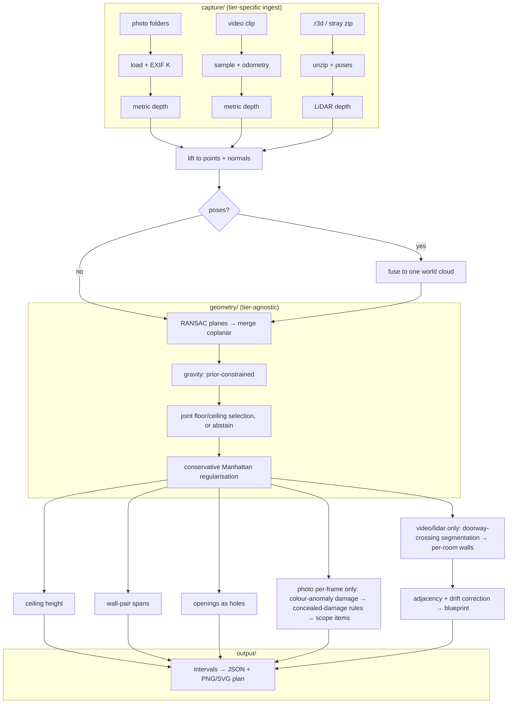
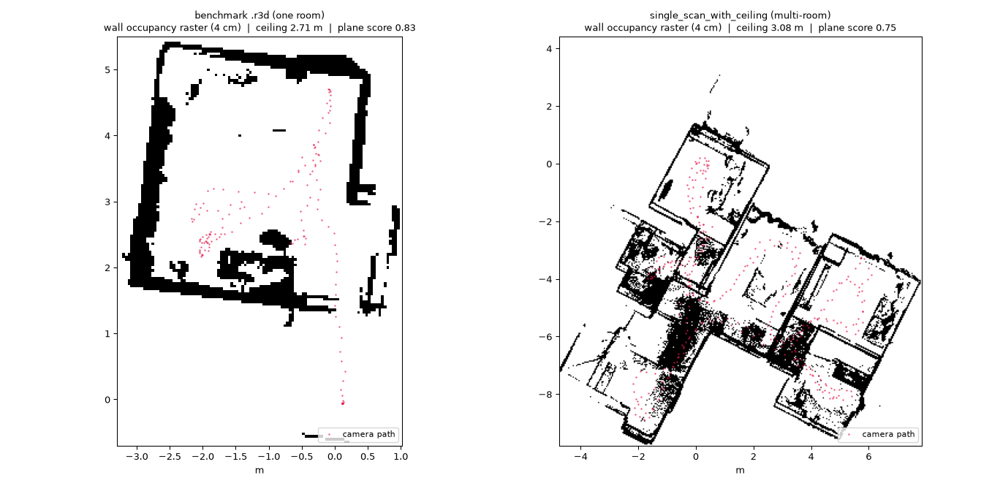
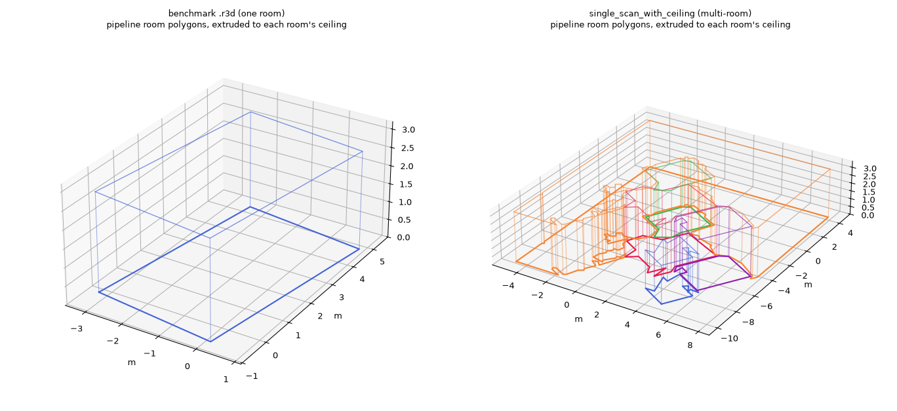
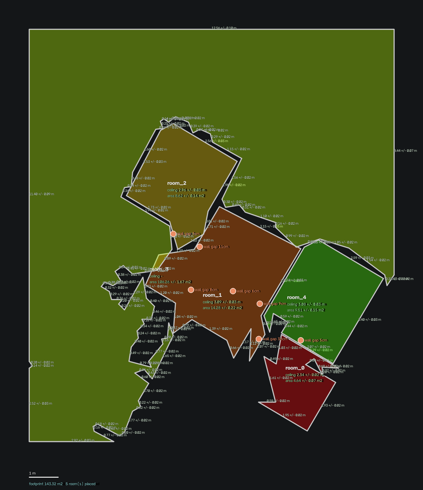

# Technical Report — Cozmo AI Case Study

Handheld capture (photo / video / LiDAR) → dimensioned property plan. One organising rule
drives every design choice below:

> **Models supply structure. Geometry computes measurements.**

A network is only ever asked for depth. Every dimension reported is the distance between
planes fitted to tens of thousands of points — auditable line by line, not a black-box guess.

---

## 1. Architecture

Everything below `capture/` is **tier-agnostic** — it branches on whether a frame carries a
pose, never on the tier name, so a video whose odometry fails degrades honestly to the
per-frame path instead of pretending it has a trajectory.

---

## 2. Tier design & device matrix

| Tier | Scale source | Poses | Hardware |
|---|---|---|---|
| Photo | Metric3D v2 depth, cross-checked against floor + camera height | None (per-frame) or recovered via cycle-gated multi-view registration | Any iPhone |
| Video | Metric3D v2 depth + RGB-D visual odometry (PnP, metric from frame 1) | Chained, with relocalisation on a broken link | Any iPhone |
| LiDAR | Sensor-native, ARKit Y-up | Every frame (ARKit) | Pro-class iPhone only — fails loudly on other devices |

---

## 3. Single-frame geometry

One photo, four things happen at once: metric depth, plane extraction, and a
floor/ceiling/wall classification driven by a gravity prior (the protocol asks the operator to
hold the phone level) — never by "the largest plane," which was tried and produced 2–22 cm
ceiling heights on real frames.

*Corners* come from intersecting adjacent wall planes with the floor, kept or rejected with a
stated reason — but a corner is only as correct as the floor it's intersected against, and
closing corners into a full room polygon is currently fragile: across every real capture this
session, exactly one room ever closed a polygon at all, and its own floor turned out to be a
bed (§7 — the same failure is not a separate bug, it is the same one shown twice). **The
dimension that is actually reliable is wall-pair separation** — the distance between two
opposite wall planes, needing no closed polygon and no correct floor: LiDAR wall pair
**3.60 m vs 3.54 m tape, +1.8%**. Corners and the polygon remain useful for area and adjacency
once the floor is right; they are not yet the load-bearing measurement.

*Openings* are found as holes in a wall's own point support — not a lifted 2D detection box,
which inherits depth error exactly where depth is worst. The door here is clean; the window's
height overshoots the true glass into the sill ledge below it, and the detector's own
confidence (0.69, against 0.81 for the door) already says so:

---

## 4. Multi-view: registration, verification, fusion

Unposed photos of one room are registered into a shared frame via SIFT correspondences, then
**cycle-consistency gated** before any pose is trusted. A pairwise fit can look perfect (a few
centimetres of residual) while the *composed* pose is wrong by metres — only a closed loop
catches that, and a spanning tree has no loops by construction. Every edge the tree doesn't use
is exactly the evidence needed to audit the edges it does.

The result, when it passes: six independently-captured photos landing on the *same* wall
lines, not six disagreeing slabs — the direct visual test of whether registration is real.

**Video/LiDAR stitching** (multi-room) reuses this same fused-cloud machinery per detected
room, then adds: **doorway-crossing segmentation** (a room change is confirmed by the scene
changing sharply — SIFT similarity dropping against the clip's own distribution — needing no
pose); **re-identification** (merge a segment back into an earlier one only if its walls
coincide *and* its centroid does — wall-matching alone is fooled by two rooms sharing a
corridor wall-line, a real bug fixed here); and **plane-anchored drift correction**, which
nudges each room's *position* to a shared floor level and along matched walls. The brief's
on/off ablation (`benchmark/scripts/ablation.py`): on a synthetic two-room flat with injected
drift, "poses used as-is" leaves a **14.1 cm** gap between the two copies of the shared wall;
correction closes it to **0.0 cm**. No real capture has closed a multi-room stitch to run
this on live (§7), so it is synthetic ground truth.

**Photo-tier property stitching** needed no separate protocol: the same cycle-gated
registration, run on all 28 photos of the 5-room capture at once, lets any incidental
cross-room overlap supply the correspondence. On this capture only one room's photos connect
and every cross-room edge is correctly rejected (implausible camera height ×2, depth-scale
ratio 1.54× / 1.76× ×2) — the capture was never shot for cross-room overlap, so refusal is
the correct answer. That the gate can still *accept* good cross-room evidence is checked on
synthetic pairs with genuine shared content (258 inliers, 0 cm residual).

---

## 5. Error budget & calibration

Ground truth: full laser survey, 5 rooms, 20 walls, 5 doors.

| Room | Ceiling error (gate ≤1.5 cm) | Worst wall error (gate ±8%) |
|---|---|---|
| Hallway | FAIL, 11.4 cm | FAIL, 23.6% |
| Kitchen | FAIL, 21.5 cm | FAIL, 28.3% |
| Room 1 | abstained | PARTIAL, 23.8% (1 span inside gate) |
| Room 2 | abstained | FAIL, 26.3% |
| Room 3 | FAIL, 23.8 cm | FAIL, 10.2% |

No room passes either gate outright. Two facts explain most of it:

1. **Depth bias grows with distance.** Ceiling height (measured close-up, ~1.5 m) comes out
   long (+4–8%); wall spans (measured across the room, 2–5 m) come out short (−23 to −38%) —
   the *same* underlying bias, read at two different ranges.
2. **Multi-view reduces random error, not the shared bias.** Fusing several biased single-frame
   estimates narrows the spread; it cannot correct a bias every frame shares. That's why gated
   multi-view moves Room 3's wall error 37.6% → 10.2% (fix-loop territory) but never crosses
   ceiling's 1.5 cm bar.

---

## 6. The fix loop

**Worst gate:** photo-tier ceiling height. 28 frames, mean −12.2%, SD 24.1%, three frames off
by −63 to −84% (a bed, or a doorway's far side, mistaken for the floor).

**Root cause:** `classify()` picked the two largest horizontal planes as floor/ceiling. Looking
through an open doorway, that can be a near floor and a door head — a physically impossible
separation reported as a confident number.

**Fix:** score every candidate pair on six signals multiplied together (support, parallelism,
horizontality, separation, bounding, camera height) and abstain below threshold.

**Result:** catastrophic frames 3 → 0, SD 24.1% → 10.6%. Does not cross the 1.5 cm gate — the
report says why (§5): the remaining error is depth-model scale bias, not plane selection, and
no amount of better plane selection fixes a biased depth map.

---

## 7. Known failure modes

**The floor plane lands on the bed when no real floor is visible.** Not a hypothesis — found
with the diagnostic overlays. The `bounding` signal can't reject it because the true floor was
never in frame; the bed genuinely is the lowest surface in that cloud.

The same failure propagates downstream: corner-finding and the room polygon are themselves
correct, but a corner intersected against the bed is a corner at bed height, and a "closed
polygon" over the bed reports a ceiling 33 cm short of true. (An earlier draft of this report
used the polygon actually closing as a *success* example without checking which floor it had
closed against — this is that correction.)

**The room polygon fails when a capture spills into the next space.** `select_room_walls`
requires nothing behind a wall; a doorway lets the sensor see past it, so nothing qualifies.
Wall-pair separation exists specifically because it needs no closed polygon; for LiDAR, §9
replaces the polygon entirely.

**Doorway-crossing segmentation did not fire on the second real video capture** despite a
confirmed multi-room walkthrough. Root cause, measured: real handheld footage has a noisy,
right-skewed frame-similarity distribution (median 0.089, MAD 0.095), so the threshold
`median − 2.5·MAD` computes to **−0.148** — below zero, so no pair can ever be flagged. The
method is synthetic-validated (21/21) and declines to fabricate rooms rather than guess; it
needs a threshold that cannot go negative, not a redesign.

**Video odometry coverage degrades on a hard walk.** 14 of 60 frames posed on the first
capture, 4 of 80 on the second (longer, more room changes). A broken link now retries against
the last posed frame for 15 frames before giving up — a real fix, verified — but does not
fully solve sparse coverage on a long multi-room walk.

**Trajectory-density segmentation over-segments a large or complex real space.** Re-running
the team-supplied LiDAR capture through the current pipeline (ARKit poses nearly every frame,
so doorway-crossing detection never applies — no RGB is decoded for that tier) stitched it
into **9 sub-rooms** with reported ceiling heights from **1.79 m to 3.08 m**, a 1.3 m spread.
These are substantial, well-populated clusters (5–88 frames each), not noise-level slivers:

A 1.3 m ceiling-height spread across "rooms" of one capture is not physically plausible for a
normal residential space — it is the signature of the bed-as-floor failure (§ above)
recurring on sub-regions of a large, cluttered, or open-plan space, not 9 verified rooms. No
ground truth exists for this property to confirm either reading. **This is why the LiDAR tier
no longer uses trajectory-density segmentation or the plane-per-wall polygon at all** — §9
replaces both with a wall-line arrangement built from the cloud itself.

---

## 8. Damage detection: first pass

`pipeline/damage/` was three `NotImplementedError` stubs; it is now a working first pass —
detection, concealed-damage rules, scope line items — unit-tested (`tests/test_damage.py`, 8
checks) and emitted in the schema output on the per-frame (photo) path. No damage was staged
and damage scoring is out of scope for this submission, so the thresholds are unfitted
defaults; this shows what the approach looks like, not a scored result.

**Method.** Detection is in image space (a stain is a colour anomaly, not something depth
shows) but the extent is metric — each region is rasterised onto its wall plane in the same
`(u, v)` frame `openings.py` uses. A cell is anomalous when its colour deviates from *that
wall's own median* by more than `4·MAD` (so a beige wall and a white wall are each judged on
their own distribution). Class is aspect-ratio only (`crack` vs `water_stain`); the
concealed-damage rules then fire at most one match and name it.

**Run against Room 1**, which carries no staged damage but has extensive real damp damage —
spalling plaster along the skirting either side of the bathroom door, and a ceiling water
stain around the fan:

20 regions across 6 frames (1 frame clean); 2 concealed-damage rules fired, both
`CONCEAL-WATER-02`. **Right:** on IMG_0446 two regions land on the real spalled-plaster band,
and that low-wall geometry is exactly what `CONCEAL-WATER-02` exists for. **Wrong:** class is
noisy (same band `crack` in two frames, `water_stain` in a third); high false-positive load
(poster collage, mirror, guitar, patterned bedsheet — any hard colour edge on a wall plane);
no cross-frame association; height-above-floor runs −0.02 to 2.65 m on the per-frame path, so
the rule's `max_height_m` gate cannot defend itself. **Needs:** staged ground truth to fit
the threshold and class boundary, a texture filter, cross-frame association, and correct
wall-vs-ceiling surface assignment.

---

## 9. LiDAR: floor plan straight from the cloud

Both LiDAR failures in §7 — the polygon returning `None` on a walkthrough, and
trajectory-density carving one scan into 9 phantom rooms — are the wrong tool for a dense
range cloud with a pose on nearly every frame. Such a cloud *has* the walls, as vertical
columns of points. `pipeline/geometry/floorplan.py` is the replacement and is now the LiDAR
path in `measure.py`; photo and video are untouched. Each LiDAR run writes `raster.png` and
`blueprint.png` next to `result.json`.

**The raster is already a floor plan.** Fit one floor and one ceiling plane, take the points
between them, drop them onto the floor, rasterise at 4 cm: a cell with a tall stack of points
is a wall. The benchmark `.r3d` is one clean room; `single_scan_with_ceiling` is an
unmistakable ~6-room flat around a cross-shaped corridor.

**Room carving is the wall-line arrangement** (Ochmann et al.; the method point-cloud →
floor-plan tools use), not trajectory density. Extract wall centre-lines by Hough, snap them
to a few dominant orientations, extend them across the plan so they cut it into faces, then
greedily merge any two faces whose separating line carries little real wall evidence — the
graph-cut smoothness term done greedily: *it only costs to put a wall between two faces where
a wall was seen*. A doorway (a short gap in a solid wall) keeps two rooms apart; an extended
line with nothing under it does not. Each room is reported as its own outline, snapped to
those wall lines — not a bounding box. **3D** is those polygons extruded to each room's
measured ceiling.

**Results.** The `.r3d` benchmark closes as **one room, 4.28 × 5.16 m, ceiling 2.70 m vs
2.74 m tape (−1.5 %)** — where the old polygon path produced nothing.
`single_scan_with_ceiling` resolves **four rooms, each with its own ceiling** (2.34 / 2.96 /
3.08 / 3.08 m), plus one flagged ~100 m² region — the corridor and the rooms it links, which
have too few internal walls to cut.

**Still wrong, stated:** the corridor/hall is absorbed into the nearest room rather than
named, so it reads as unlabelled space; the large open area is drawn as one flagged block;
the wall-snap pulls a room's outline ~5–15 % inside its raw footprint. Synthetic-validated
(`tests/test_floorplan.py`, incl. a furniture-in-a-room case the distance-transform method
split); the real captures have no floor-plan ground truth, so the dimensions are unscored.

---

## 10. Status against the brief

| | Status |
|---|---|
| All 3 tiers, one command, one output contract | Done |
| Photo multi-view registration, cycle-verified | Done |
| Video multi-room stitching + blueprint | Built, synthetic-validated; no real video multi-room result has closed yet (§7) |
| LiDAR multi-room floor plan | Built — wall-line arrangement from the cloud (§9). Benchmark `.r3d` closes as one room, ceiling −1.5% vs tape; a real multi-room scan resolves 4 rooms + 1 flagged unresolved region. Room dimensions unscored (no floor-plan ground truth) |
| Drift accountability, on/off ablation | Done — `benchmark/scripts/ablation.py`, synthetic: 14.1 cm shared-wall gap "poses as-is" → 0.0 cm corrected (§4) |
| Fix loop, declared and shipped | Done |
| Ceiling / wall gates | Fail — root cause identified, not a mystery |
| Calibration, scored per tier | Done — `benchmark/scripts/calibrate.py`. Photo intervals cover ~50% at nominal 95%: bias-dominated, not an interval-width problem |
| Repeatability gate | **Fail — unrepeatable.** Checked at the video tier: two independent walkthroughs of the same property (IMG_0460, IMG_0462) agree only on ceiling height — the one scalar both produce — and it disagrees by **18.8 cm** (2.830 m vs 3.018 m), against a 1 cm gate. Not repeatable-but-biased; genuinely unrepeatable. Neither clip closes a polygon or resolves per-room correspondence (§7 — odometry posts 14–16 / 4 of their frames), so there are no per-wall lengths to compare. |
| Head-to-head vs incumbent | Out of scope (confirmed with the team) |
| Damage detection | First pass built, wired on the per-frame path and emitted in the schema output; synthetic-tested and run against real Room 1 (§8). Unfitted thresholds — out of scope for scoring |

Full row-by-row detail: `docs/COMPLIANCE_MATRIX.md`. Reproduction commands: `README.md`.
